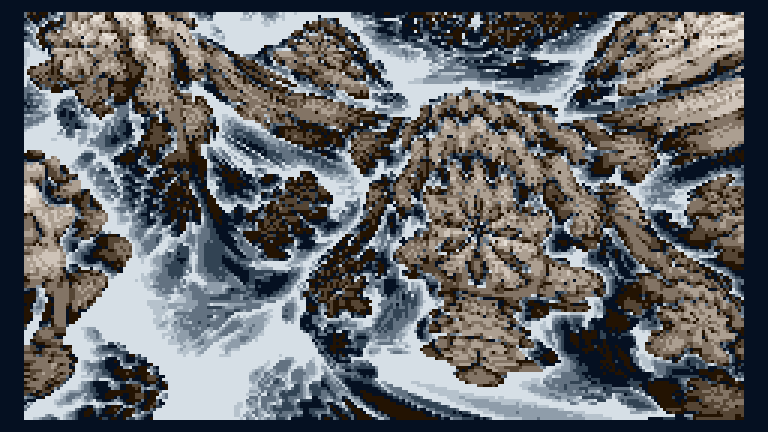

# Distance estimated shores - TIC-80 256b executable graphics - Lovebyte 2023

This repository contains the unpacked source for the TIC-80 256b
executable graphics "Distance estimated shores", made by pestis /
brainlez Coders! and released at Lovebyte 2023 tiny executable graphics
compo.

Source: https://github.com/vsariola/distance-estimated-shores

Tested with TIC-80 1.0.2164 pro. Packed with
[pakettic](https://github.com/vsariola/pakettic).

Greets to superogue, havoc, psenough, jeenio, HellMood, jobe, nesbox,
dave84, TomCat, exoticorn, ferris, Jin X, ttg, unlord, gopher, okkie,
Řrřola, hannu, wrighter, Dresdenboy, aldroid, baze, noby, p01, PoroCYon,
DevEd, byteobserver, sensenstahl, Virgill, Ped7g, gasman, LJ, ilmenit,
deater, Fready, Blossom, alia and everyone at the Sizecoding discord!

Just a simple raymarched mandelbulb for compo support.

License: [MIT](LICENSE)

